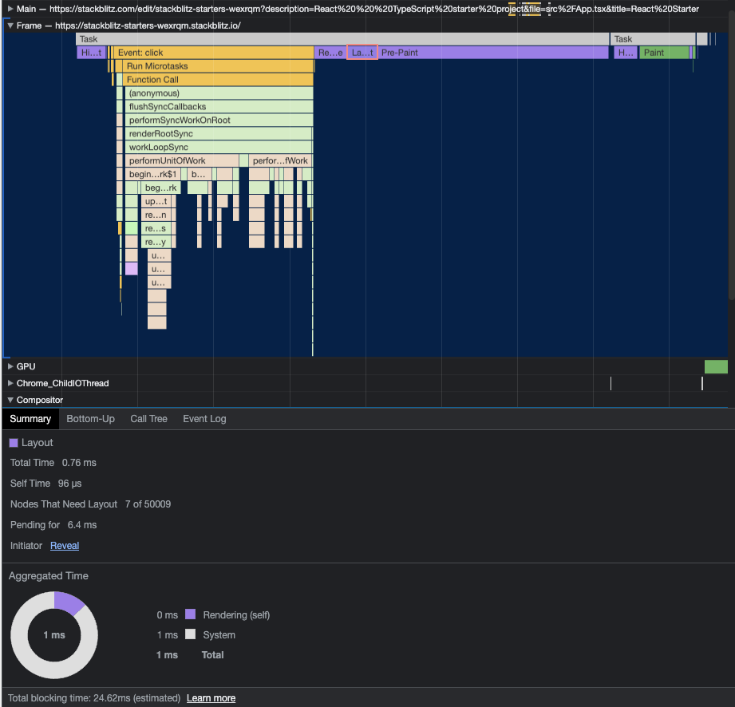
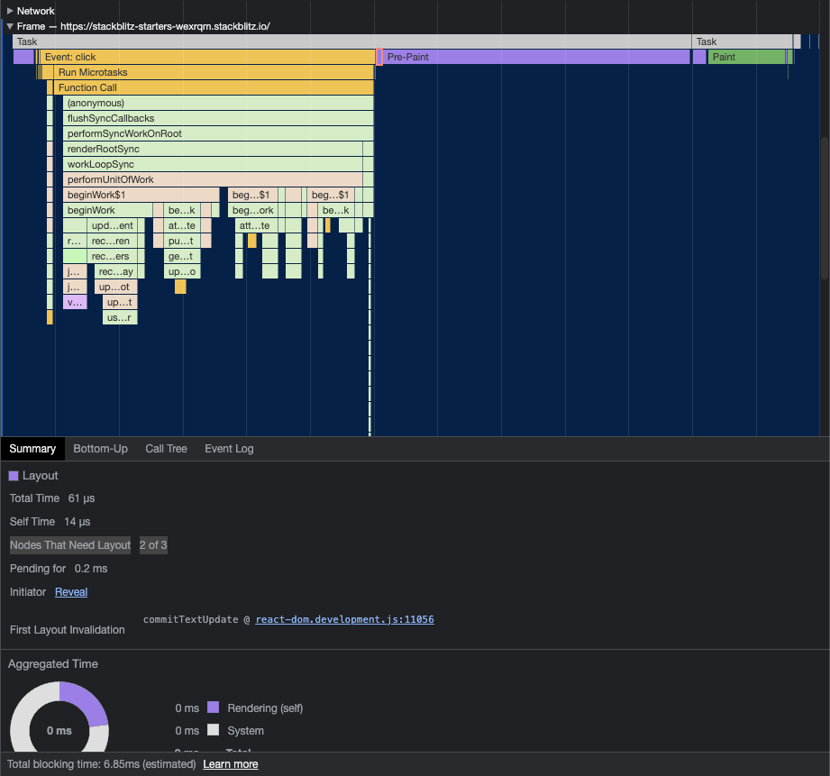

# React Layout Boundary


React Layout Boundary: By using this component, you can explicitly set layout boundaries in browser rendering to optimize performance or enhance rendering efficiency.

## Installation

The easiest way to install [`react-layout-boundary`](https://www.npmjs.com/package/react-layout-boundary) is with [npm](https://www.npmjs.com/).

```bash
npm install react-layout-boundary
```

Alternately, download the source.

```bash
git clone https://github.com/stegano/react-layout-boundary.git
```

## Usage

### LayoutBoundary
When changes occur within child elements wrapped by the `LayoutBoundary` component, the browser will reposition and render only the nodes within the `LayoutBoundary` component, instead of recalculating all nodes in the document.

```tsx
import { LayoutBoundary } from "react-layout-boundary";

const Component = () => {
  // ...
  return (
    <LayoutBoundary>
      {/* Place your component content here */}
    </LayoutBoundary>
  );
};
```

### Performance measurement
> [!] Rendering performance can differ depending on the browser or device environment being used. On the demo page, more than 50,000 nodes were created to clearly observe these performance variations.

Demo: https://stackblitz.com/edit/stackblitz-starters-wexrqm

#### Without LayoutBoundary


#### With LayoutBoundary
